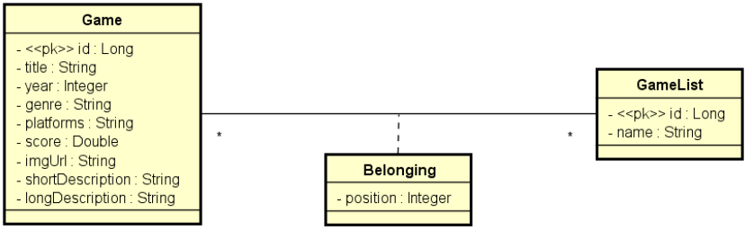

# Projeto java spring

## Descrição:

Este projeto é um sistema de coleções de jogos e foi desenvolvido em conjunto com <a href="https://devsuperior.com.br">
DevSuperior</a>  com o intuito de
obter mais cocnhecimento sobre o desenvolvimento back end e relembrar conceitos.

### Funcionalidades:

- Buscar todos os jogos
- Buscar um jogo especifico por id
- Buscar todas as coleções de jogos
- Buscar uma coleção de jogo em específico
- Possibilidade de reposicionar jogos na coleção

## Tecnologias Utilizadas

- Java
- Frameworks:
    - Spring Boot
    - Spring Data JPA
- Banco de dados em memória H2
- Ferramentas de desenvolvimento
    - IntelliJ IDEA
    - Maven
    - Git

### Ambiente local

- Docker Compose

### Implantação em produção

- Railway
- Banco de dados PostgreSQL

## Arquitetura do Projeto

Este projeto foi desenvolvido seguindo a arquitetura de Desenvolvimento Orientado por Domínio (DDD).  Para facilitar
o
gerenciamento do código em diferentes ambientes, foi separado em três diferentes ambientes:

- Teste
- Homologação
- Produção

## Modelo de domínio

## Aprendizados

### API

É só o que está exposto para a web, então falar que o back end e api são a mesma coisa conceitualemnte
não é a mesma coisa até porque no back-end tem muito mais coisa do qeu está exposto a API

é a interface para mexer com o bacj end

#### Padrão REST

- Cliente/servidor com HTTP
- Comunicação statless (\*) - não guarda estado,
- Interface uniforme, formato padronizado (\*)
- Cache
- Sistema em camadas
- Código sob demanda (opcional)

#### Boas práticas de REST:

- Não se utiliza verbo no endpoint e sim substântivo

### Erro padrão Spring

Whitelabel Error Page
This application has no explicit mapping for /error, so you are seeing this as a fallback.

Tue May 09 20:49:56 BRT 2023
There was an unexpected error (type=Not Found, status=404).

### @Embeddable

> A anotação @Embeddable é usada em um objeto Java para indicar que ele pode ser incorporado em outra entidade.
> Ao encapsular dois atributos na classe BelongingPK e ao utilizar a classe BelongingPK como um atributo da classe
> Belonging e o atributo BelongingPK representar dois campos na tabela do banco relacional precisa-se colocar a anotação
> @Embeddable.

### Função copyProperties(gameEntity, this)

> BeanUtils.copyProperties(gameEntity, this): copia todas as propriedades de uma classe para outra, isso, se as classes
> tiverem os mesmo nomes dos atributos.
**Ao utilizar essa função a classe precisa ter os getters e setters**

### Projection

> Serve para fazer uma consult SQL customizada no Spring Data JPA

- É uma interface que no Spring chamamos de projection e que dentro dessa interface consta metodos get correspondente a
  consulta realizada no repository

### Railway

> Railway é uma plataforma de infraestrutura na qual podemos fazer o deploy da aplicação na nuvem

### CORS_ORIGINS

> No cors_origins é especificado quais hosts, endreços estão autorizados a acessar o backend da minha aplicação.
> Bloqueia uma aplicação não autorizada.

### Integração e entrega continua

> Se refere quando temos um projeto que está na nuvem e quando fazemos uma nova atualização em alguma branch
> automaticamente vai disparar um novo deploy com isso o railway vai integrar essa nova mudança e implantar novamente
> no railway

### @Modifying

> Ao fazer uma operação no BD que não seja o Select utilizando uma query nativa a anotação @Modifying se faz necessária

<h3 style="color:#ee3b3b"> Idempotência</h3>

> Uma operação é idempotente se ela executada uma ou mais de uma vez produz o mesmo resultado
>  Ex: Ao atualizar o endereço da minha residencia informando a rua e o número ao salvar esses dados 1 vez ou dez
> vezes
> sempre vai dar na mesma ou seja seria uma operação idempotente

- PUT: É utilizado quando uma operação é idempotente
- POST: É utilizado para criar e também atualizar quando o método não é idempotente

## Relembrando

- camelCase: primeira palavra minúscula e a primeira letra de cada nova palavra maiúscula
  Ex: valorFinal

- @Column(columnDefinition = "TEXT"): embora a string do Java aceite até 4GB ao não colocar essa anotação em um atributo
  que irá receber um texto longo a JPA ao fazer ORM ela vai entender que queremos que ela mapeie o atributo para um
  campo no BD como varchar, que aceita somente 255 caracteres

- (DTO) Data transfer objects: Objetos customizados com informações precisas
    - Algumas funções importantes do DTO
        - Abstração dos detalhes de implementação
        - Redução do tráfego de rede
        - Padronização (sempre retornar DTO) e as vezes resolve o problema quando temos
          associações cíclicas na entidade porque ao tentar retonar isso na APi vai ter um ciclo infinito

- Não precisa da palavra reservada **this** quando não tem ambiguidade, ou seja, quando não temos um parametro com o
  mesmo nome do atributo da classe presente.

- map(): transforma um objeto em outro

- Relacionamento
    - manyToMany: Quando temos uma relação de muitos para muitos com informações adicionais precisamos ter uma classe de
      associação que no modelo recalional vai ser uma tabela de asociação

    - Como estamos programando de forma O.O e estamos utilizando o repository que faz referencia para a entidade e para
      o tipo do id, onde temos que ter **1** tipo pro id
      então temos que ter uma classe auxiliadora BelongingPK que irá conter os dois atributos Game e GameList e assim na
      classe Belonging teremos o atributo BelongingPK onde a chave primaria vai ser a composição das duas chaves
      estrangeiras Game e GameList.

- @Transactional: é uma boa prática colocar em todos os métodos da service para que ele fique transacional obedecendo
  aos principios das transações que é o ASID (atômica, consistente, isolada e durável)
  @Transactional(readOnly = true): significa que estamos assegurando que não vamos fazer nenhuma operação de escrita,
  isso deixa mais rápido a consulta.

- @PathVariable: é uma anotação Spring usada para anotar um parâmetro de método para vinculá-lo a uma variável de modelo
  de URI. Ele recupera o valor da variável da URL da solicitação atual e o vincula ao parâmetro anotado.   